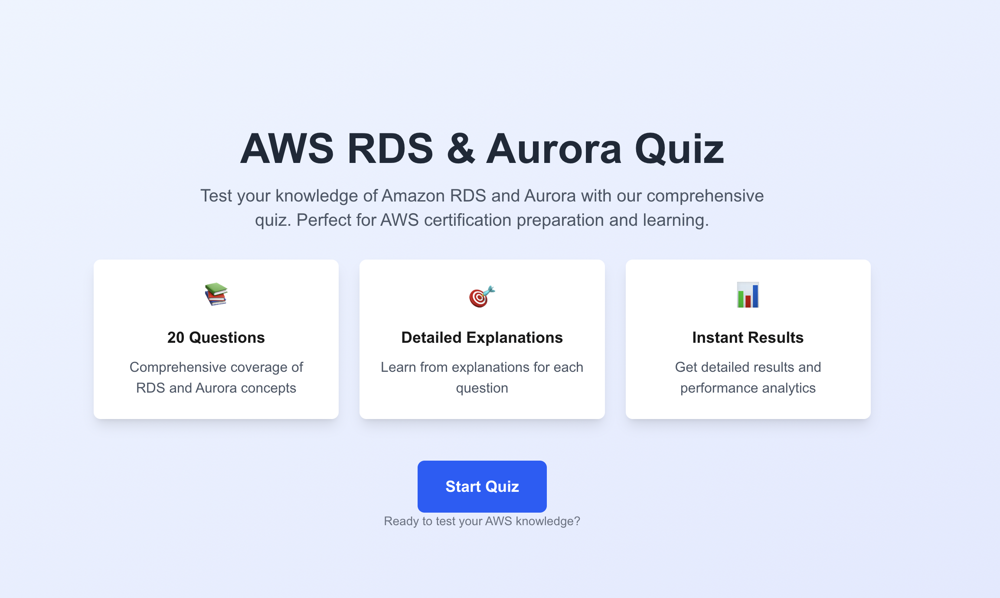

# AWS RDS & Aurora Quiz

A comprehensive quiz application for testing knowledge of Amazon RDS and Aurora services. Built with a modern Next.js frontend and a robust Go backend API.

## 🏗️ Architecture

- **Frontend**: Next.js 14 with TypeScript, Tailwind CSS, and Framer Motion
- **Backend**: Go with Gin framework, GORM, and SQLite
- **Database**: SQLite with seeded AWS RDS & Aurora questions
- **API**: RESTful API with comprehensive endpoints

## 📁 Project Structure

```
rds/
├── aws-rds-quiz/              # Next.js Frontend
│   ├── src/
│   │   ├── app/               # App Router pages
│   │   ├── components/        # React components
│   │   └── lib/              # API client & utilities
│   ├── public/               # Static assets
│   └── package.json
├── aws-rds-quiz-backend/      # Go Backend API
│   ├── config/               # Configuration
│   ├── database/             # Database setup & seeding
│   ├── handlers/             # API handlers
│   ├── middleware/           # CORS, logging middleware
│   ├── models/               # GORM models
│   ├── utils/                # Response utilities
│   └── main.go              # Application entry point
└── README.md
```

## 🚀 Quick Start

### Prerequisites

- **Node.js** 18+ and **npm**
- **Go** 1.21+
- **Git**

### Backend Setup

1. **Navigate to backend directory:**
   ```bash
   cd aws-rds-quiz-backend
   ```

2. **Install Go dependencies:**
   ```bash
   go mod tidy
   ```

3. **Run the backend server:**
   ```bash
   go run main.go
   ```

   The backend will start on `http://localhost:8080` with:
   - Database auto-initialization with seeded questions
   - CORS enabled for frontend integration
   - Comprehensive logging

### Frontend Setup

1. **Navigate to frontend directory:**
   ```bash
   cd aws-rds-quiz
   ```

2. **Install dependencies:**
   ```bash
   npm install
   ```

3. **Start the development server:**
   ```bash
   npm run dev
   ```

   The frontend will start on `http://localhost:3000`

## 📚 Features

### Frontend Features
- **Modern UI**: Beautiful, responsive design with Tailwind CSS
- **Smooth Animations**: Framer Motion for engaging user experience
- **Real-time Progress**: Live progress tracking during quiz
- **Detailed Results**: Comprehensive results with explanations
- **Error Handling**: Graceful error handling and retry mechanisms
- **Loading States**: Smooth loading indicators

### Backend Features
- **RESTful API**: Complete CRUD operations for questions and quiz submissions
- **Database Management**: Automatic database initialization and seeding
- **CORS Support**: Cross-origin resource sharing enabled
- **Comprehensive Logging**: Request/response logging
- **Error Handling**: Structured error responses
- **Data Validation**: Input validation and sanitization

## 🔌 API Endpoints

### Health Check
- `GET /health` - Service health status

### Questions
- `GET /api/v1/questions` - Get all questions
- `GET /api/v1/questions/random?count=10` - Get random questions
- `GET /api/v1/questions/:id` - Get specific question

### Quiz Management
- `POST /api/v1/quiz/submit` - Submit quiz answers
- `GET /api/v1/quiz/results/:id` - Get quiz results

### Example API Usage

```bash
# Get random questions
curl http://localhost:8080/api/v1/questions/random?count=5

# Submit quiz
curl -X POST http://localhost:8080/api/v1/quiz/submit \
  -H "Content-Type: application/json" \
  -d '{
    "userId": "user123",
    "answers": [
      {"questionId": 1, "selectedAnswer": 2},
      {"questionId": 2, "selectedAnswer": 0}
    ],
    "timeSpent": 120000
  }'
```

## 🗄️ Database Schema

### Questions Table
```sql
CREATE TABLE questions (
  id INTEGER PRIMARY KEY,
  question TEXT NOT NULL,
  options TEXT NOT NULL, -- JSON array
  correct_answer INTEGER NOT NULL,
  explanation TEXT,
  category TEXT,
  difficulty TEXT,
  created_at DATETIME,
  updated_at DATETIME,
  deleted_at DATETIME
);
```

### Quiz Submissions Table
```sql
CREATE TABLE quiz_submissions (
  id INTEGER PRIMARY KEY,
  user_id TEXT NOT NULL,
  answers TEXT NOT NULL, -- JSON array
  time_spent INTEGER NOT NULL,
  score REAL NOT NULL,
  total_questions INTEGER NOT NULL,
  correct_answers INTEGER NOT NULL,
  created_at DATETIME,
  updated_at DATETIME,
  deleted_at DATETIME
);
```

## 🎯 Quiz Content

The application includes comprehensive questions covering:

- **Amazon RDS Fundamentals**
  - Database engines (MySQL, PostgreSQL, Oracle, SQL Server)
  - Multi-AZ deployments
  - Read replicas
  - Backup and recovery

- **Amazon Aurora**
  - Aurora MySQL and PostgreSQL
  - Aurora Serverless
  - Aurora Global Database
  - Performance optimization

- **Advanced Topics**
  - Security and encryption
  - Monitoring and logging
  - Migration strategies
  - Cost optimization

## 🛠️ Development

### Backend Development

```bash
# Run with hot reload (if using air)
air

# Run tests
go test ./...

# Build binary
go build -o quiz-backend main.go
```

### Frontend Development

```bash
# Run development server
npm run dev

# Build for production
npm run build

# Run production server
npm start

# Run linting
npm run lint
```

## 🔧 Configuration

### Environment Variables

**Frontend** (`.env.local`):
```env
NEXT_PUBLIC_API_URL=http://localhost:8080
```

**Backend** (config/config.go):
```go
type Config struct {
    Server struct {
        Host string `default:"localhost"`
        Port string `default:"8080"`
    }
    Database struct {
        DSN string `default:"quiz.db"`
    }
    CORS struct {
        AllowedOrigins []string `default:"http://localhost:3000"`
    }
}
```

## 🚀 Deployment

### Backend Deployment
1. Build the binary: `go build -o quiz-backend main.go`
2. Set environment variables
3. Run: `./quiz-backend`

### Frontend Deployment
1. Build: `npm run build`
2. Deploy to Vercel, Netlify, or your preferred platform

## 🤝 Contributing

1. Fork the repository
2. Create a feature branch: `git checkout -b feature/new-feature`
3. Commit changes: `git commit -am 'Add new feature'`
4. Push to branch: `git push origin feature/new-feature`
5. Submit a pull request

## 📝 License

This project is licensed under the MIT License - see the [LICENSE](LICENSE) file for details.

## 🙏 Acknowledgments

- AWS Documentation for comprehensive RDS and Aurora information
- Next.js team for the amazing React framework
- Gin framework for the lightweight Go web framework
- Tailwind CSS for the utility-first CSS framework

## 📞 Support

For questions or issues:
1. Check the [Issues](../../issues) page
2. Create a new issue with detailed information
3. Include system information and error logs

---

**Happy Learning! 🎓** 